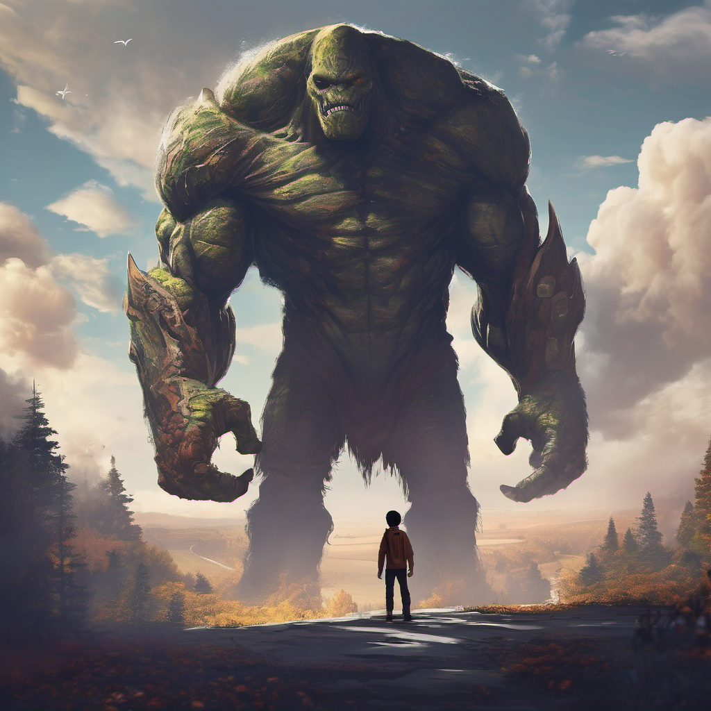

# Hero versus Monster 
 

## About project

I have the instruction to have 2 dynamic health bar for Hero & monster, 4 buttons : Attack, SpéAttack, Heal & Giveup.
and optionally Fight logs.

- 
- 
- 
- 
- 
- 
- 
- 

## Author :

* Romain